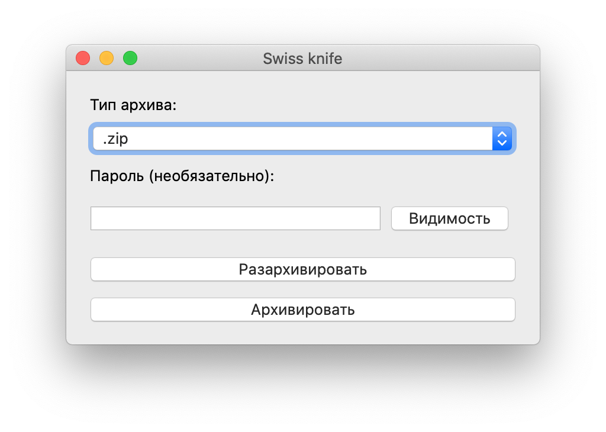
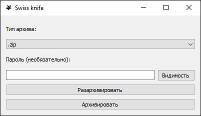

# Swiss knife
Версия: 0.1.2

    

    

## На данный момент поддерживается
1. Разархивировать .7z, .zip, .rar (требуется установка brew install rar)
2. Архивировать .7z, .zip, .rar (требуется установка brew install unrar) с паролем и без пароля

## Сборка с помощью pyinstaller:
macOS:
* builders/mac/build.sh

Windows:
* builders\windows\build.ps1