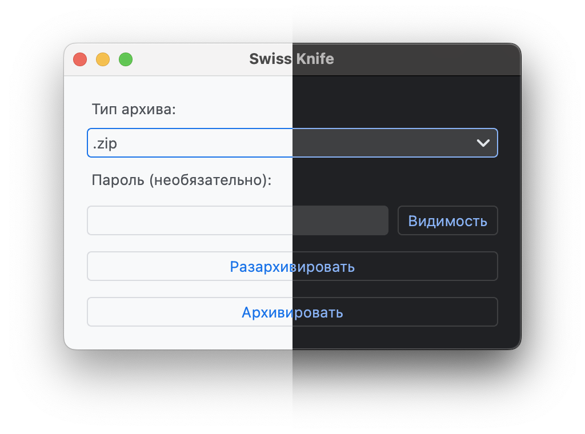
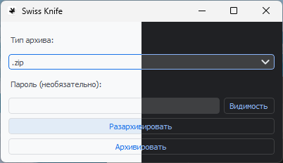

# Swiss knife
Версия: 0.2.0

    

    

## Требования
1. python 3.10
2. unrar (опционально, нужен для работы с *.rar)

## На данный момент поддерживается
1. Разархивировать .7z, .zip, .rar (требуется установка модуля rar: brew / macports / website) - с паролем / без пароля
2. Архивировать .7z, .zip - с паролем / без пароля

## Сборка с помощью pyinstaller:
macOS:
* builders/mac/build.sh

Windows:
* builders\windows\build.ps1